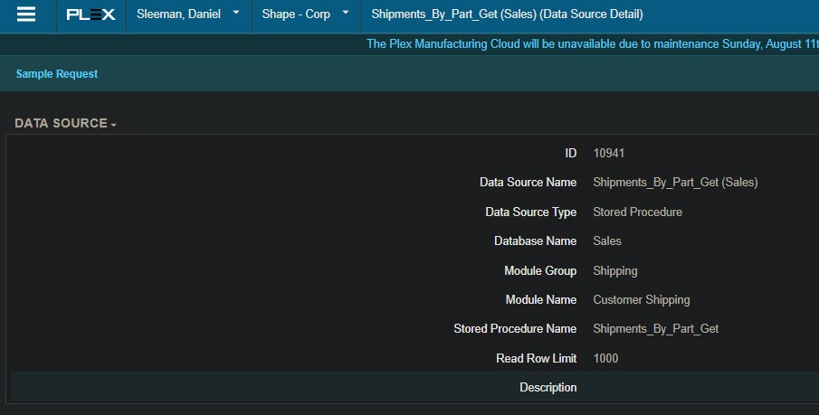
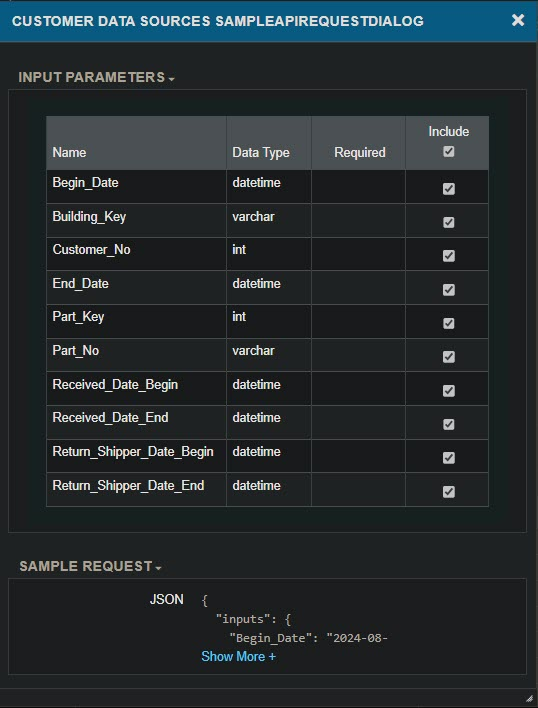
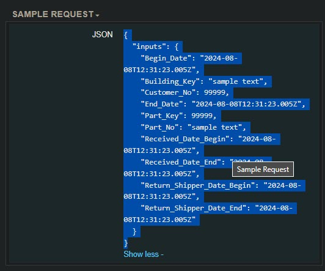
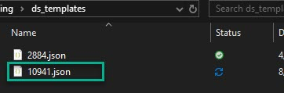

# UX_Data_Source_Tools

Functions that are regularly used with python tools in managing Plex web service calls and other common operations.

# CustomSslContextHTTPAdapter class

Plex has a bug with their PROD server where it does not support TLS 1.3.  
The TEST server does support this.  
I've added this class to include the legacy server connect option when using OpenSSL 3+

# UXResponse class

Stores the response as an object with each key:value pair as an attribute.  
additional attributes of `_request_body_`, `_status_code_`, and `_transaction_no_` are added for tracking and debugging purposes.

# UXDataSourceInput class

Used for more cleanly managing data source testing and usage.  
This allows for default attributes to be kept for all inputs.  
You can then apply changes and/or remove/keep specific inputs being used.  

When modifying attributes, the `update_query_str()` function will be invoked automatically.  

Plex supports 2 formats for the requests/responses.  
Use `call_format` arg to define this.  
Default is 1.
- Format 1: request body must have `{'inputs':{'key':'value'}}` format
    - Will return a body with columns in one list and rows in another
- Format 2: request body must only have `{'key':'value'}` format
    - Will return a body with a list of dictionaries for each row in `{'header':'value'}` format

Each format supports returning data as a pandas dataframe, `UXResponse` class list, or direct JSON string.

# PlexApi class

This class will allow for calling the latest Plex REST APIs in a similar manner to the UX web services.

## update_query_str()

Recompiles the `__query_string__` class attribute for web service calls

## pop_inputs()

Removes attributes based on supplied args.  
Can also keep specific args when supplying a list of attribute names with the `keep` kwarg.

Ex:
```python
ds_dict = {
    '6079':( # User_Manager_Role_Update (Plexus_Control)
        ("Add_By", 99999),
        ("Admin", 99999), # R
        ("Location", "sample text"), # R
        ("Member", 99999), # R
        ("Plexus_User_No", 99999), # R
        ("Role_History_Key", 99999), # R
        ("Role_Key", 99999) # R
        # Group_Name (Direct)
        # IntelliPlex_Groups (Direct)
    ),
}

api_id = '6079'

class_instance = UXDataSourceInput(api_id, call_format=2, **dict(ds_dict[api_id]))
class_instance.Add_By = 209144
class_instance.Admin = 1
class_instance.Member = 1
class_instance.pop_inputs('Location')
```

## type_create()

Sets up the default input types using the format of Plex's example query.  
Called on class initialization.

## get_to_update()

Takes the output from a `UXResponse` and adds the attributes to a `UXDataSourceInput`. 


## type_reconcile()

Converts the current class attribute values to the type in the `__input_types__` attribute.

## purge_empty()

Removes all `None` type values from the class.

Also removes any variables not included in the initial inputs using the `__input_types__` attribute.


# UX_Data_Sources class

Basic usage:

```python
import ux_data_source_tools as UDST
ux = UDST.UX_Data_Sources(pcn='PCN_Name',db='TEST',pcn_config_file='path/to/config_file.json')
query = [
    ("input_name",input_value),
    ("second_key",second_value)
]
# call the web service with ID 123456 in the test database without creating a dataframe.
ux.call_web_service(123456, query, db='TEST', dataframe=False)
```
You can also use the previous example using the `UXDataSourceInput` class as the query.
```python
ux.call_web_service(123456, class_instance, db='TEST', dataframe=False)
```
The response can also be formatted into a list of classes containing each column as an attribute.
```python
ux.call_web_service(123456, class_instance, db='TEST', dataframe=False, classlist=True)
```
`dataframe=True` will override `classlist=True` but no error will be thrown if both are provided.

## set_auth(pcn, pcn_file)

Creates the basic authentication for web service accounts.
Takes a JSON file configured to store the web service credentials.

**This is not required if you provide an HTTPBasic authentication to the `UX_Data_Sources.authentication` attribute separately.**

```python
set_auth('PCN_Name', pcn_config_file='path/to/config_file.json')
```

config_file.json:
```json
    "PCN_Name":{
        "pcn":"PCN_NO",
        "prefix": "",
        "api_user": "webaccount@domain.com",
        "api_pass": "password",
        "forecast": 1,
        "default_week_no": "1"
    }
```

## get_week_index(input_date,week_start_offset)

Takes a date and gives the relative week index and start date
week_start_offset - Default Monday=0
If the Sunday before Monday should be the start, use -1

Returns a tuple of values
- formatted_date - ISO formatted date for web service calls
- week_index - The week number of the date compared to today. I.E. 0,1,2 weeks in the future
- year_offset - Similar to above, how many years ahead the date is from today
- group_start_date - custom date used for grouping releases together. Essentially the Monday of that date's week. Uses the week_start_offset value

## call_web_service(api_id, query, pcn, db, dataframe)


Calls a plex web service to return the values.

Parameters:
- api_id: the UX data source ID
- query: The query parameter. It can be one of the following types evaluated in this order:
    - An instance of `UXDataSourceInput`
    - A dictionary (dict)
    - A list of tuples (list[tuple])
    - A tuple of tuples (tuple[tuple])
    - A single tuple (For single inputs)
- pcn: the PCN to which to connect
- db: the plex database connection to use
- dataframe: whether to return a dataframe object. Supercedes `classlist`
- classlist: whether to return a list of `UXResponse` classes.

Returns:
- if dataframe is true, a pandas dataframe.
- if classlist is true, a list of `UXResponse` classes.
- else a json reponse string from the web service.

examples for the query:

```python
query = [
    ("input_name",input_value),
    ("second_key",second_value)
]
query = {
    "input_name":input_value,
    "second_key":second_value
}
```

## plex_date_formatter(*args, date_offset)

Takes 'normal' date formats and converts them to a Plex web service 

Returns ISO format datetime in UTC timezone

Should support local machine timezone conversion to UTC.

Can also take a single datetime object.

- plex_date_formatter(2022,09,11) -> 2022-09-11T04:00:00Z
- plex_date_formatter(2022,09,11,18,45) -> 2022-09-11T22:45:00Z  
Next day if hours fall into 20-24 period
- plex_date_formatter(2022,09,11,22) -> 2022-09-12T02:00:00Z

date_offset arg will add days to the provided time  
Useful when providing just a datetime object to the function

## make_csv_dict(row)

When reading a csv file and iterating through loops, I find this useful to validate the proper columns exist.  
This also allows the source file to have columns in any order while still being able to reference them by index.

```python
file = 'input_file.csv'
with open(file, 'r', encoding="utf-8") as cust_invoices:
    csv_reader = csv.reader(cust_invoices, delimeter=',')
    for i, row in enumerate(csv_reader):
        if i == 0:
            column_dict = ux.make_csv_dict(row)
            continue
        try:
            plex_invoice_no = row[column_dict['PlexInvoiceNo']]
            pcn_no = row[column_dict['PlexPCN']]
            supplier = row[column_dict['PlexSupplier']]
            supplier_no = row[column_dict['PlexSupplierNo']]
            invoice_link = row[column_dict['PlexInvoiceLink']]
            plex_uuid = row[column_dict['PlexInvoiceUUID']]
            currency = row[column_dict['PlexCurrency']]
        except KeyError:
            status.config(text="Error with column name."
                                " Please verify you are using the"
                                " correct workbook version.")
```

# PlexClassicDataSource

A class that can be used to make classic SOAP data source calls.

Subclass of `PlexDataSource`.

Takes basicHTTP authentication.

Usage example:

Adding supplier certs using classic data source key 57073.


```python
from ux_data_source_tools import PlexClassicDataSource, ClassicDataSourceInput,ClassicConnectionError
input_file = 'cert_reference.csv'
pcn = 'NetShape GH'
db = 'test'
wsdl = os.path.join(os.getcwd(),'resources','Plex_SOAP_test.wsdl')
pc = PlexClassicDataSource(pcn=pcn,db=db,wsdl=wsdl)


with open(input_file,'r',encoding='utf-8-sig') as f:
    c = csv.DictReader(f)
    for r in c:
        try:
            ci = ClassicDataSourceInput(57073)
            # All attributes added here should match the data sources screen.
            ci.MP1_Supp_Cert_List_Key = r['Supplier_Cert_List_Key']
            ci.MP1_Begin_Date = r['Begin_Date']
            ci.MP1_Expiration_Date = r['Expiration_Date']
            ci.MP1_Note = r['Note']
            ci.MP1_Parent = r['Parent']
            ci.MP_Supplier_Cert_Key = r['Supplier_Cert_Key']
            ci.Cert_Supplier_No = r['Cert_Supplier_No']
            response = pc.call_data_source(ci)
        except ClassicConnectionError as e:
            print(f'{pcn} - Failed to be added - {str(e)}')
```

# Tips

When calling a UX data source, save a json file based on the sample call from the Plex screen.

* Locate the data source details and click on "Sample Request"  

* Click "Show more"  

* Highlight the JSON and copy the text  

* Paste into notepad
* Save the file as a .json file with a name matching the data source ID  



When initializing your data source input object, pass in the template file path.

```python
u = UXDataSourceInput(10941,template_folder='ds_templates')
u.pop_inputs(keep=[]) # Removes the default values from the template file
```

Using this method, the `UXDataSourceInput` object will have an attribute which records the expected input types properly.

This will allow you to use a csv source file for all the inputs without needing to define the types manually.

EX:

```python
from ux_data_source_tools import PlexDataSource, UXDataSourceInput
import csv

in_file = 'csv_file_from_SQL.csv'
ds_id = 10941
pcn = 'PCN REFERENCE NAME'
db = 'test'
ux = PlexDataSource(pcn,db)
# You must use utf-8-sig encoding if exporting from classic SQL development environment.
with open(in_file,'r',encoding='utf-8-sig') as f: 
    c = csv.DictReader(f)
    for r in c:
        u = UXDataSourceInput(ds_id,template_folder='ds_templates',call_format=2)
        u.pop_inputs(keep=[])
        for k,v in r.items():
            # This will set all the input parameters from the CSV using the column names.
            # The CSV columns should all match the data source input names.
            setattr(u,k,v)
        # This will change the attribute types based on the template's expected types.
        u.type_reconcile()
        # Any non-string inputs as None type need to be removed or they will likely cause issues.
        u.purge_empty()
        r = ux.call_web_service(ds_id,u,pcn,db,classlist=True)
```

# Examples

Example of updating two fields in a tool record without impacting existing values or requiring them in the input file:

csv file contains 3 columns:  
`Surface_Area, Standard_Tool_Life, Tool_Key`
``` python
from ux_data_source_tools import UXDataSourceInput, PlexDataSource
import csv
ux = PlexDataSource()
input_file = 'tool_list.csv'
template_folder = 'ds_templates'
with open(input_file, 'r',encoding='utf-8-sig') as f: #Use utf-8-sig if saving a sql report from Plex classic directly to csv.
    reader = csv.DictReader(f)
    for row in reader:
        api_id = '2006'
        get_instance = UXDataSourceInput(api_id, template_folder=template_folder)
        get_instance.pop_inputs('Supplier_No')
        get_instance.Tool_Key = row['Tool_Key']
        get_instance.type_reconcile()
        resp = ux.call_web_service(api_id, get_instance, classlist=True)
        api_id = '2067'
        update_instance = UXDataSourceInput(api_id, template_folder=template_folder)
        update_instance.get_to_update(resp[0])
        update_instance.Surface_Area = row['Surface_Area']
        update_instance.Standard_Tool_Life = row['Standard_Tool_Life']
        update_instance.Tool_Key = row['Tool_Key']
         # Do this after setting new values from csv since they will likely be interpreted as strings
        update_instance.type_reconcile()
        # Not all inputs are nullable, so if the values are None anyway, not sending them will act the same as sending an empty string.
        update_instance.purge_empty()
        upd_resp = ux.call_web_service(api_id, update_instance, classlist=True)
```

Example of updating a customer ship-to address ship-from default

This takes a SQL report which uses key values from one PCN and links them to the new PCN for the data source to use.

```python
from ux_data_source_tools import UX_Data_Sources, UXDataSourceInput
import csv
from pathlib import Path
import json

pcn = 'NetShape GH' # The key value in the pcn_config.json file.
db = 'test' # don't use period here, although it will allow it. 
ux = UX_Data_Sources(pcn, db) # credentials are stored in a file resources/pcn_config.json by default. Can also be passed as an input for this class.

api_id = '18599'
# Updated records are stored in a file to make sure duplicates are not added on subsequent runs.
updated_records_file = 'updated_records.json'
if Path(updated_records_file).is_file():
    with open(updated_records_file,'r',encoding='utf-8') as j:
        updated_records = json.load(j)
else:
    updated_records = []

infile = 'ship_from_defaults.csv'
with open(infile,'r',encoding='utf-8-sig') as f:
    d = csv.DictReader(f)
    for row in d:
        try:
            # Initialize a UXDataSourceInput object
            c = UXDataSourceInput(api_id)
            # 18599
            """
            Unique key value for record updates
            Customer_No + Customer_Address_No + Ship_From_Building_Key
            """
            unique_key = f"{row['New Customer No']}_{row['New Customer Address No']}_{row['New Building Key']}"
            if unique_key in updated_records:
                continue
            if not row['New Building Key'] or not row['New Supplier No']:
                continue
            if row['New Route No']:
                c.BOL_Route_No = row['New Route No'] # Not required, but not nullable so needs to be omitted if blank
            if row['New Supplier No']:
                c.Carrier_No = int(row['New Supplier No'])
            c.Customer_Address_No = int(row['New Customer Address No']) # Input type requires int. CSV will be string.
            c.Customer_No = int(row['New Customer No'])
            c.Include_Revision_Entry = True # Not required - Getting error on viewing 'green book' record. Existing records are also showing errors here.
            if row['New Pool Address No']:
                c.Pool_Customer_Address_No = int(row['New Pool Address No']) # Not required
            if row['New Route ID']:
                c.Route_ID = row['New Route ID'] # Not required
            c.Ship_From_Building_Key = int(row['New Building Key'])
            
            r = ux.call_web_service(api_id,c,pcn,db,classlist=True)
            updated_records.append(unique_key)
            # Response returns class list. Normally just single item getting returned.
            print([(i.outputs,i.transactionNo) for i in r])
        except Exception as e:
            print(e)
        finally:
            with open(updated_records_file,'w+',encoding='utf-8') as j:
                j.write(json.dumps(updated_records))
```

Example of calling an API (new developer portal)

Downloading EDI documents through APIs
```python
from ux_data_source_tools import PlexApi
import base64
import os
from datetime import datetime
from decouple import config # For storing api key and other config separately from the code.
def ediDecode(ediFile64):
    return str(base64.b64decode(ediFile64).decode('utf-8'))
class ediDocument(object):
    def __init__(self,**kwargs):
        """
        This will create an EDI document object and format the datestrings appropriately.
        Some EDI log dates have different formats.
        """
        self.__dict__.update(kwargs)
        if hasattr(self,'logDate'):
            try:
                d = datetime.strptime(self.logDate,'%Y-%m-%dT%H:%M:%S.%fZ')
            except ValueError:
                d = datetime.strptime(self.logDate,'%Y-%m-%dT%H:%M:%SZ')
            self.logDate = d.strftime('%Y-%m-%dT%H:%M:%SZ')
            self.fileDate = d.strftime('%Y-%m-%d')
# Main variable setup
# config file is stored in settings.ini
# DO NOT PUBLISH THIS TO GIT
api_key = config('api_key')
db = config('db', default='test.') # DO use a dot here.
pcn = config('pcn',default='79870')

customer_name = 'GENERAL MOTORS CORPORATION' # GM - MGO
document = ['DELFOR','DELJIT']
out_folder = 'list\\directory\\here' # leave blank for script directory. Can be relative pathing also

# Get the customer Resource_ID using the customer name
m = 'get' # Method
u = f'https://{db}connect.plex.com/mdm/v1/customers' # URI
c = PlexApi(m,u,api_key) # PlexApi class object
c.name = customer_name # Set variables for the request
r = c.call_api(pcn) # Make the call
customer_id = r[0]['id'] # response returns a list, so the first item's id attribute is what you need for other calls.

# Get EDI logs for that customer
log_start_date = '2024-07-15T04:00:00Z'
log_end_date = '2024-07-16T04:00:00Z'
m = 'get'
u = f'https://{db}connect.plex.com/edi/v1/logs'
c = PlexApi(m,u,api_key)
c.customerId = customer_id
c.action = 'Receive'
c.mailboxActive = True
c.logDateBegin = log_start_date
c.logDateEnd = log_end_date
r = c.call_api(pcn)
edi_id_list = []
for y in r:
    edi_id_list.append(ediDocument(**y))
# Filter for documents in the document list. There is no way to specify multiple documents when making the EDI logs request, so we get everything and filter them later.
edi_release_list = [i for i in edi_id_list if i.documentName in document]

# Download the EDI documents
m = 'get'
for edi_doc in edi_release_list:
    u = f'https://{db}connect.plex.com/edi/v1/documents/{edi_doc.id}'
    c = PlexApi(m,u,api_key)
    r = c.call_api(pcn)
    # EDI is downloaded as base64 encoded string and needs to be decoded for human readable version
    edi_raw = ediDecode(r[0]['rawDocument'])
    with open(os.path.join(out_folder,f'{pcn}_{customer_name}_{edi_doc.fileDate}_{edi_doc.ediKey}_{edi_doc.documentName}.txt'),'w+',encoding='utf-8') as out_file:
        out_file.write(edi_raw)

```